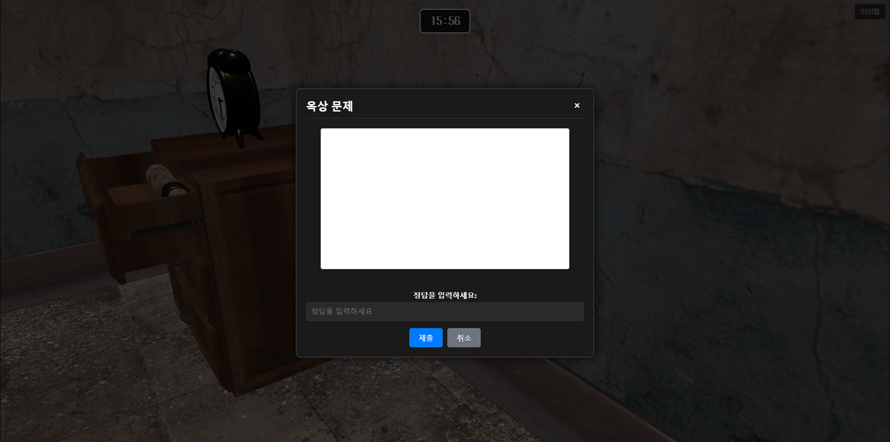

# Escape 404 

## 팀프로젝트

구성원 : 강민창(팀장), 김소령, 심서진

기간 : 2025.06.26 ~ 2025.08.11

역할

- 강민창 : 3D 씬 세팅 및 디자인, 3D 오브젝트 배치 및 애니메이션 적용, 에러 상태 처리 개선

- 김소령 : 3D 씬 세팅 및 디자인, 3D 오브젝트 배치 및 애니메이션 적용, 메인 페이지 UI 제작 및 개선

- 심서진 : 3D 씬 세팅 및 디자인, 3D 오브젝트 배치 및 애니메이션 적용, 사운드 시스템 구현, 로딩 페이지 UI 제작 및 개선

### 프로젝트 소개

팀원 모두 게임 개발에 대한 관심은 있었지만, 개인적으로 도전하기엔 경험이 부족하다고 느꼈습니다. 
이에 협업을 통해 각자의 역량을 보완하며, 혼자 진행하는 것보다 완성도 높은 웹 게임을 만들어보고자 본 주제를 선정하였습니다. 
또한, 프로젝트를 통해 새로운 툴을 직접 사용해보고 학습함으로써 실무 감각을 키우고자 하는 마음이 컸습니다.

그래서 저희는 1인칭 시점과 퀄리티 있는 3D 모델 씬 구성과 실감나는 사운드를 통해 공포와 긴장감을 조성하고 
EASY, NOMAL, HARD 총 3개의 난이도와  각각의 시나리오로 구성되어 플레이어가 몰입해 문제를 해결할 수 있도록 기획했습니다.

### 기능

- 메인페이지 및 로딩페이지 
- 3D 환경에서 자유로운 이동 (WASD)
- 마우스로 시점 조작
- 다양한 상호작용 요소 (문, 커튼, 상자 등)
- 문제 해결 시스템
- 실시간 타이머
- 효과음 및 배경음악
- 다중 방 구조 (입원실, 수술실, 지하실 등)

### 장점

- 실시간 3D 렌더링: Babylon.js를 활용한 고퀄리티 3D 모델의 실시간 렌더링 및 1인칭 시점 구현

- 몰입형 UX/UI: 공포 장르에 맞춘 사운드, 조명, 타이머 등으로 몰입감 높은 사용자 경험 설계

- 다단계 시나리오: EASY/NORMAL/HARD 난이도와 분기 구조를 통해 다양한 사용자 니즈 반영

- 협업 중심 개발: GitHub 기반의 버전 관리와 팀 협업으로 문제 해결과 일정 조율 경험

- 폭넓은 기술 스택: Node.js, React, Babylon.js 등 다양한 기술을 활용한 Full-Stack 프로젝트 수행

- 다양한 공간 구성: 입원실·수술실·지하실 등 씬 전환 기반의 구조적 공간 설계 구현

- 상호작용 설계: 문·커튼·상자 등 사용자 행동에 따라 반응하도록 구현

### 사용기술 및 개발환경

- 개발환경 : VS Code, Window 10 pro

- 백엔드 : Node.js

- 프론트엔드 : React, Babylon.js, CSS

- 버전관리 : GitHub

